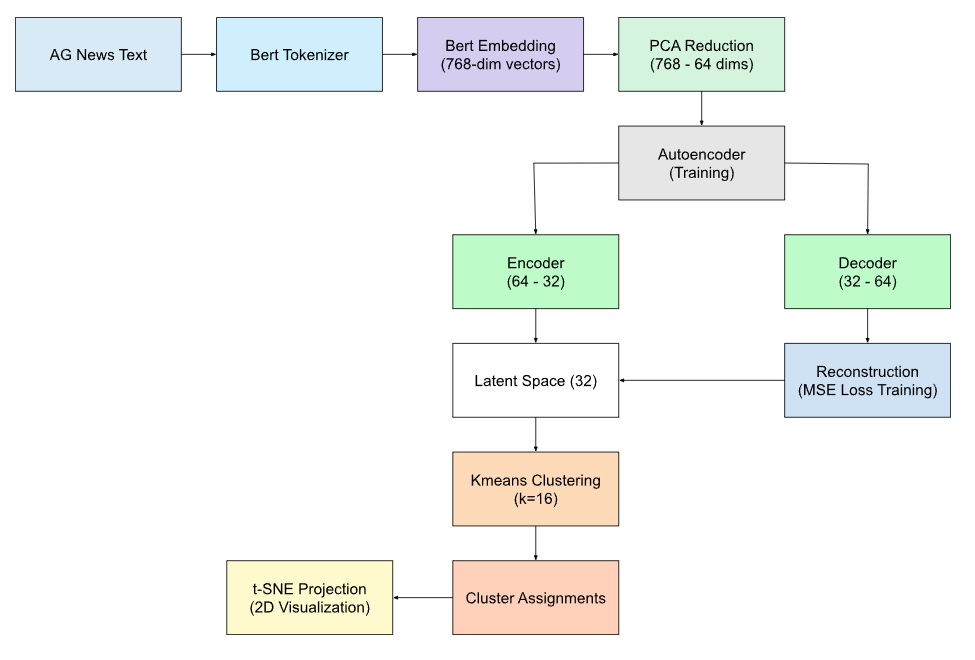
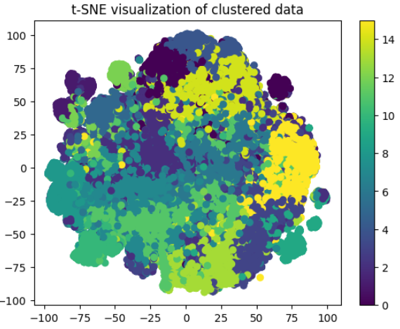

#  Clustering with Neural Networks using Hugging Face Datasets

This project implements an unsupervised learning pipeline to cluster news headlines from the **AG News dataset** using deep learning and traditional clustering methods. The system combines **BERT embeddings**, **PCA dimensionality reduction**, an **autoencoder**, and **KMeans** clustering — with comprehensive evaluation and visualization.

---

##  Project Structure

```
.
├── model.py / notebook.ipynb    # Implementation (autoencoder, training loop)
├── tsne.png                     # t-SNE visualization of final clusters
├── block_diagram.png            # Block diagram of full model pipeline
├── final_report_complete.tex    # Full IEEE LaTeX report with experimental results
├── README.md                    # You're here!
```

---

##  Model Architecture

- **Input**: AG News headlines  
- **Embedding**: `bert-base-uncased` (768D)  
- **Dimensionality Reduction**: PCA → 64D  
- **Autoencoder**:  
  - Encoder: Linear(64→512) → ReLU → Linear(512→32)  
  - Decoder: Linear(32→512) → ReLU → Linear(512→64)  
- **Clustering**: KMeans on 32D latent space (`k=16`)  
- **Visualization**: t-SNE for 2D cluster projection



---

##  Dataset

- Source: [AG News Dataset](https://huggingface.co/datasets/ag_news)
- Total samples: 120,000  
- Classes:
  - `World`, `Sports`, `Business`, `Sci/Tech`
- Equal distribution: 30,000 samples per class

---

## ⚙ Hyperparameters

| Parameter             | Value     |
|-----------------------|-----------|
| PCA Dimensions        | 64        |
| Latent Vector Size    | 32        |
| Batch Size            | 32        |
| Epochs                | 100       |
| Learning Rate         | 0.001     |
| Clustering Algorithm  | KMeans (k=16) |

---

##  Evaluation Results

| Method                  | Silhouette Score | Davies-Bouldin Index |
|------------------------|------------------|----------------------|
| KMeans on PCA          | 0.0838           | 2.4802               |
| Autoencoder + KMeans   | 0.0715           | 2.3910               |

 **Estimated Accuracy** via pseudo-labeling: **71.20%**  
 **Trainable Parameters** in Autoencoder: **99,424**



---

##  Limitations

- KMeans requires predefined `k` and assumes spherical clusters.  
- BERT embeddings often encode dense, overlapping semantics.  
- No dropout or batch norm; regularization was implicit via latent bottleneck.

---

##  Future Work

- Add contrastive learning to improve embedding separability  
- Use dynamic clustering or DEC loss  
- Integrate visualization into an interactive dashboard

---

## 🧑‍💻 Author

**Asim Ajwad Gani**  
Department of Computer Science and Engineering, BRAC University  
Email: asim.ajwad.gani@g.bracu.ac.bd
